# :bar_chart: Bank Marketing Campaign Analysis

> **Which customers are most likely to subscribe to a term deposit - and when should the bank call them?**\
> This project uses Python, SQL and Logistic Regression to find out.

---

## :card_index_dividers: Table of Contents
- [Project Overview](#project-overview)
- [Tools & Technologies](#tools--technologies)
- [Dataset](#dataset)
- [Project Structure](#project-structure)
- [Key Findings](#key-findings)
- [Visualizations](#visualizations)
- [Business Recommendations](#business-recommendations)
- [How to Reproduce](#how-to-reproduce)
- [Author](#author)

---

## :mag_right: Project Overview

Direct marketing campaigns are expensive. Every call that fails to convert represents wasted agent time, operational const and a missed revenue opportunity. This project analyses a real Portuguese bank's phone-based marketing campaign data to identift exactly which customers, contact strategies and timing windows drive term deposit subscriptions - and which ones quietly drain campaign budget.

The analysis is structured across three Jupyter notebooks:
1. Data loading, structural exploration and PostgreSQL ingestion.
2. Full EDA across customer demographics, campaign strategy, timing and economic context - producing 9 visualizations.
3. Logistic Regression model to predict subscription likelihood, with feature importance analysis and ROC-AUC evaluation.

---

## :wrench: Tools & Technologies

| Tool | Purpose |
|------|---------|
| Python (Pandas, Matplotlib, Seaborn) | Data analysis and visualization |
| Scikit-learn | Logistic Regression model, evaluation metrics |
| PostgreSQL | Data storage and SQL EDA |
| SQLAlchemy | PostgreSQL - Python connection |
| DBeaver | PostgreSQL GUI and query execution |
| Jupyter Notebook (VS Code) | Analysis narrative and presentation |
| Git / Github | Version control and project hosting |

---

## :clipboard: Dataset

**UCI Bank Marketing Dataset**\
Source: [Kaggle](https://www.kaggle.com/datasets/henriqueyamahata/bank-marketing)

| Property | Value |
|----------|-------|
| Rows | 41,188 Contacts |
| Columns | 21 Variables |
| Missing Values | None |
| Date Range | 2008 - 2013 |
| Target Variable | 'y' - Term Deposit Subscription (Yes/No) |

**Key Variable Used:** age, job, marital, education, contact, month, day_of_week, campaign, pdays, previous, poutcome, emp.var.rate, cons.price.idx, cons.conf.idx, euribor3m, nr.employed, y

> **Note:** This is a real-world dataset from a Portuguese banking institution. The target variable is heavily imbalanced - 88.7% No vs 11.27% Yes - reflecting realistic campaign conditions. All model decisions account for this imbalance explicitly.

---

## :pushpin: Project Structure

```
bank-marketing-analysis/
|
├── data/
│   └── bank-additional-full.csv
|   └── bank-additional-names.txt
|
├── notebooks/
│   ├── 01_load_and_explore.ipynb
│   ├── 02_eda_analysis.ipynb
│   └── 03_model.ipynb
|
├── sql/
│   └── 01_eda_queries.sql
|
├── visualizations/
│   ├── 01_overall_conversion.png
│   ├── 02_conversion_by_job.png
│   ├── 03_conversion_by_month.png
│   ├── 04_contact_frequency.png
│   ├── 05_previous_outcome.png
│   ├── 06_contact_channel.png
│   ├── 07_demographics.png
│   ├── 08_call_duration.png
│   ├── 09_correlation_heatmap.png
|   ├── 10_confusion_matrix.png
|   ├── 11_roc_curve.png
│   └── 12_feature_importance.png
|
├── README.md
└── requirements.txt
```

---

## :closed_book: Key Findings

### 1. :red_circle: Overall Conversion Rate is Just 11.27% - Campaigns are Highly Inefficient
Out of 41,188 customer contatcs, only **4,640 resulted in a subscription**. The remaining 36,548 contacts - 88.73% of all campaign effort - produced no outcome. This baseline immediately frames the core problem: the bank is spending significant resources on contacts with a very low probability of conversion. Targeted segementation rather than broad outreach is the most direct level available.

---

### 2. :red_circle: Students and Retirees Convert at 3x the Rate of Blue-Collar Workers

| Job Segment | Conversion Rate |
|-------------|-----------------|
| Student | 31.4% |
| Retired | 25.2% |
| Unemployed | 14.2% |
| Admin | 13.0% |
| Blue-Collar | 6.9% |

Students and retirees are the highest-converting segments by a significant margin, yet they represent only **975 and 1,720 contacts respectively** out of 41,188 total - a combined 6.3% of all campaign volume. Blue-Collar workers recieve 9,254 contacts (22.5% of all calls) at only 6.9% conversion. The bank is directing disproportionate effort at its lowest-converting segment.

---

### 3. :red_circle: May is the Worst Month to Run Campaigns - But Receives the Most Calls

| Month | Total Contacts | Conversion Rate |
|-------|----------------|-----------------|
| March | 546 | 50.5% |
| December | 182 | 48.9% |
| September | 570 | 44.9% |
| October | 718 | 43.9% |
| May | 13,769 | 6.4% |

**May receives 13,769 contacts - 33.4% of all campaign volume - at only 6.4% conversion.** March, September, October and December all exceed 40% conversion rates with a combined total of just 2,016 contacts. The inverse relationship between contact volume and conversion rate by month represents the clearest budget real location opportunity in the dataset.

---

### 4. :red_circle: Cellular Contact Converts at Nearly 3x the Rate of Telephone

| Channel | Total Contacts | Conversion Rate |
|---------|----------------|-----------------|
| Cellular | 26,144 | 14.74% |
| Telephone | 15,044 | 5.23% |

Despite telephone contact producing less than a third of cellular's conversion rate, it still accounts for **36.5% of all campaign contacts**. Shifting telephone budget toward cellular outreach would directly improve campaign ROI without any change to targeting, timing or messaging.

---

### 5. :red_circle: Contact Frequency Shows Immediate Diminishing Returns

| Contacts Made | Conversion Rate |
|---------------|-----------------|
| 1 | 13.0% |
| 2 | 11.5% |
| 3 | 10.7% |
| 4 | 9.4% |
| 5+ | Below 8.0% and falling |

Conversion rate drops consistently with each additional contact attempt. The optimal window is **1 to 2 contacts per campaign**. Customers receiving 5 or more contacts convert at below 8% - yet the dataset contacts contacts up to 56 attempts. Over-contacting is a measurable waste of agent time and likely damages customer perception.

---

### 6. :red_circle: Previous Campaign Success is the Strongest Conversion Signal

| Previous Outcome | Conversion Rate |
|------------------|-----------------|
| Success | 65.1% |
| Failure | 14.2% |
| No Prior Contact | 8.8% |

Customers who subscribed in a previous campaign convert at **65.1%** in the current one - nearly 6x the rate of customers with no prior contact. Only 1,373 customer (3.3% of the dataset) fall into this category, yet they represent the highest-certainty conversion segment available. Prioritising re-engagement of previous subscribers should be the first targeting decision in any new campaign.

---

### 7. :red_circle: Logistic Regression Achieves ROC-AUC of 0.801

| Metric | Value |
|--------|-------|
| Model | Logistic Regression (class_weight=balanced) |
| Train Size | 32,950 rows (80%) |
| Test Size | 8,238 rows (20%) |
| ROC-AUC | 0.801 |
| True Positives | 599 |
| True Negatives | 6,281 |
| False Positives | 1,029 |
| False Negatives | 329 |

**Top Predictive Features:** Employment variance rate (-2.311) is the dominant negative predictor - customers are significantly less likely to subscribe during periods of high employment variance. Consumer price index (+1.152) is the strongest positive predictor. Telephone contact (-0.305) and May calls (-0.195) confirm EDA findings at the model level. Prior campaign success (+0.102) remains a positive signal even after controlling for all other variables.

> **Technical Note:** 'duration' (call duration is seconds) was deliberately excluded from the model. It is only known after the call ends - including it would constitute data leakage and produce artifically inflated performance metrics. The model is built entirely on features available before the call is made, making it genuinely actionable for pre-campaign targeting.

> **Technical Note:** 'class_weight=balanced' was applied to the Logistic Regression to account for the 88.73% / 11.27% class imbalance in the target variable. Without this adjustment, the model would default to predicting "no" for nearly all cases and still achieve high accuracy while being useless for identifying actual subscribers.

---

## :chart_with_upwards_trend: Visualizations

### Overall Conversion Rate
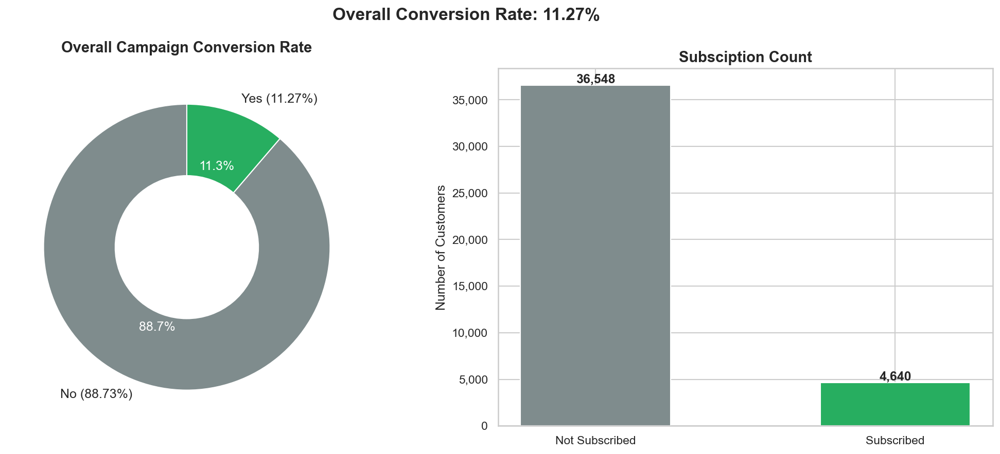

### Conversion Rate by Job Type
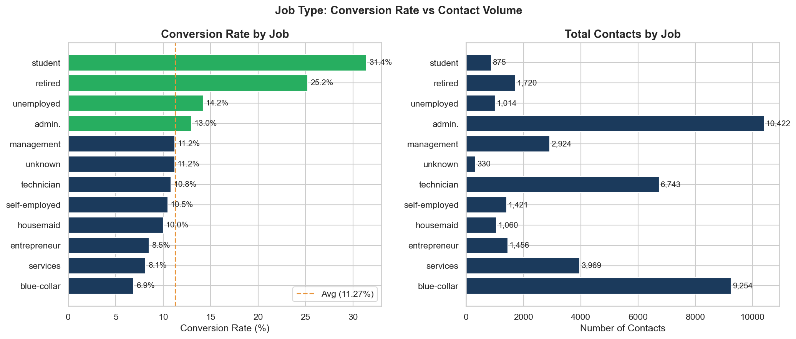

### Campaign Volume vs Conversion Rate by Month
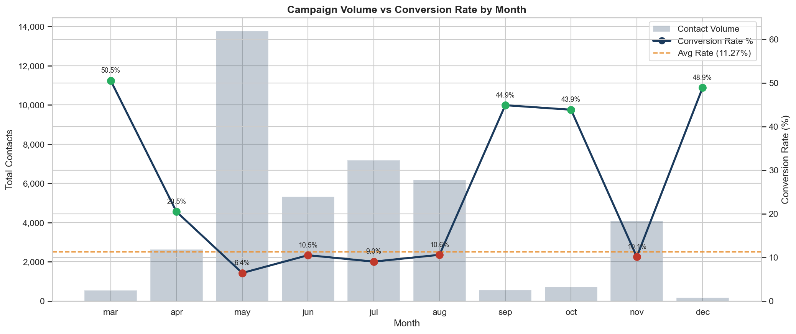

### Contact Frequency - Diminishing Returns
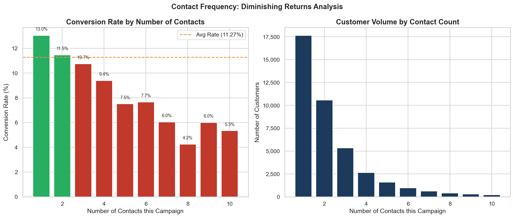

### Previous Campaign Outcome vs Current Conversion
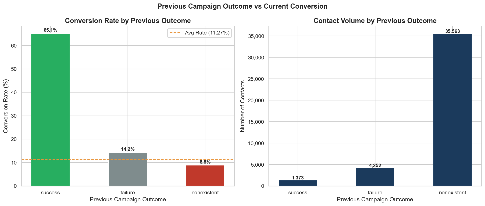

### Cellular vs Telephone - Conversion & Volume
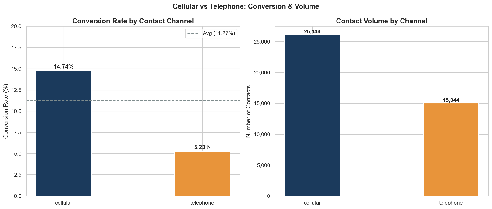

### Customer Demographics - Age & Education
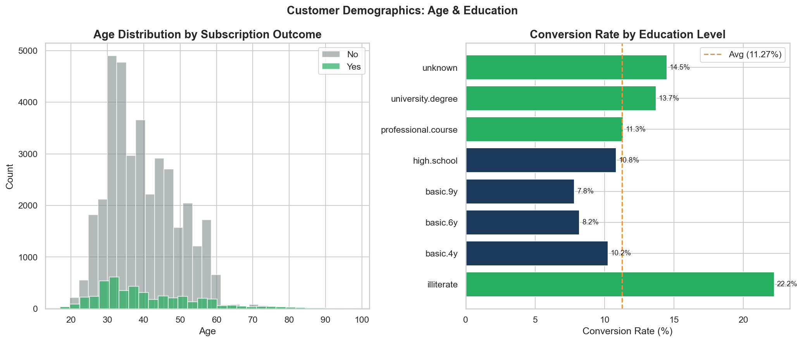

### Call Duration vs Subscription Outcome
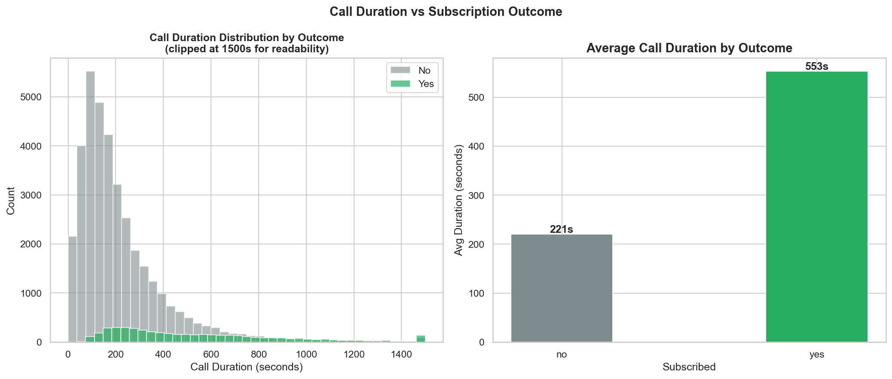

### Correlation Matrix - Numeric Features
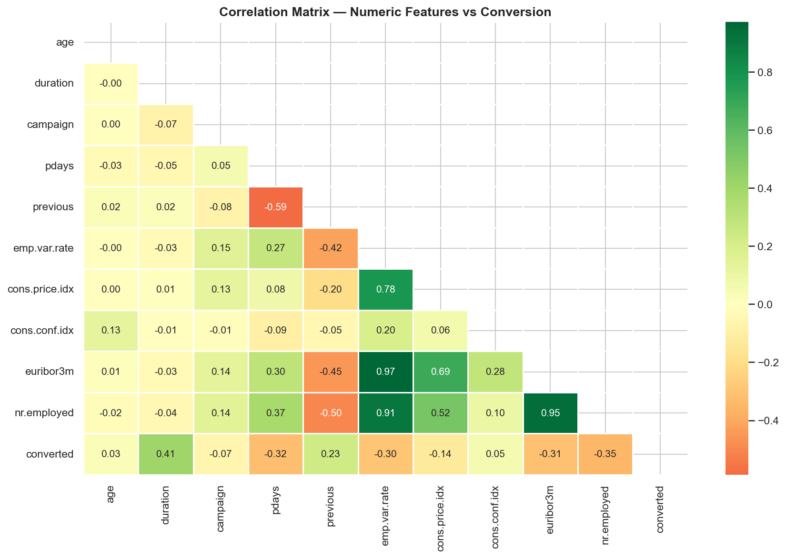

### Confusion Matrix - Logistic Regression
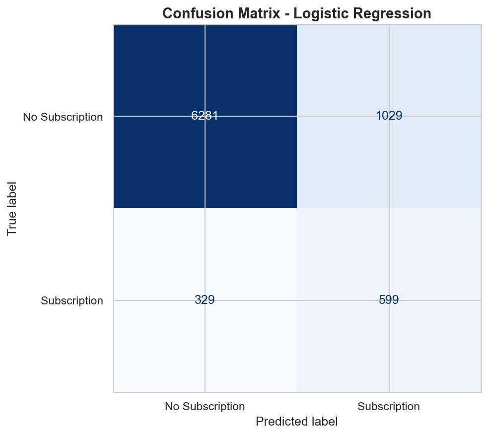

### ROC Curve
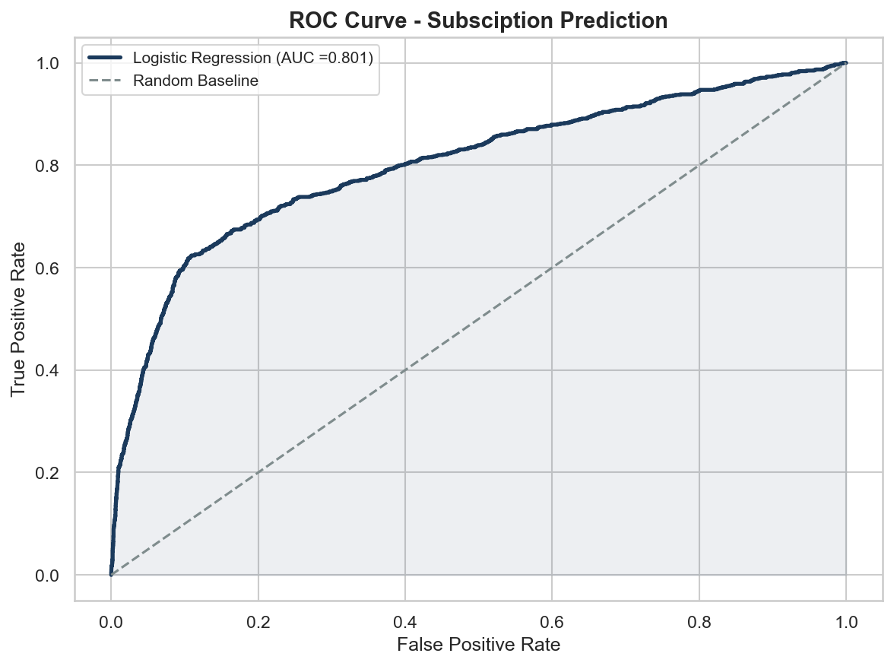

### Feature Importances
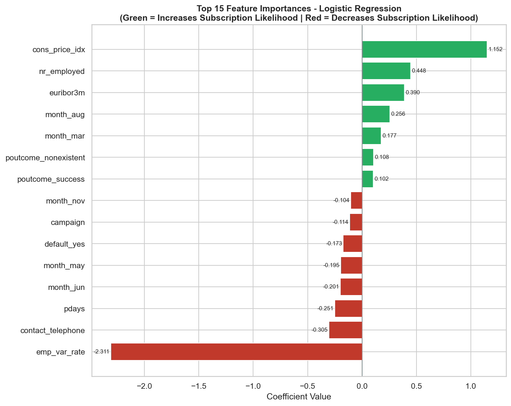

---

## :bulb: Business Recommendations

### Recommendation 1 - Reallocate May Campaign Budget to High-Conversion Months *(Priority: Critical)*
May receives 33.4% of all campaign calls at only 6.4% conversion - the lowest rate of any month. March, September, October and December all exceed 40% conversion with a fraction of the contact volume. Shifting even 30% of May's budget to these four months would dramatically improve overall campaign conversion rate without increasing total spend. This is the highest-impact, lowest-cost change available.

### Recommendation 2 - Prioritise Re-Engagement of Previous Subscribers *(Priority: Critical)*
Customers with a prior successful subscription convert at 65.1% - nearly 6x the overall average. Only 1,373 such customers exist in the dataset, yet they represent the most certain conversion opportunity available. Every new campaign should begin by targeting this segment before any broader approach outreach. Their conversion certainty makes them the lowest cost-per-acquisition cohort by a significant margin.

### Recommendation 3 - Shift Contact Budget from Telephone to Cellular *(Priority: High)*
Telephone contact converts at 5.23% versus cellular at 14.74% - a 2.8x difference. Telephone still accounts for 36.4% of all campaign contacts. A phased shift of telephone budget toward cellular outreach, beginning with the lowest-converting telephone segments, would improve campaign ROI directly. Where cellular numbers are unavailable, these contacts should be deprioritised in campaign planning.

### Recommendation 5 - Increase Campaign Focus on Students and Retirees *(Priority: Medium)*
Students convert at 31.4% and retirees at 25.2% - both more than double the overall average - yet together they represent only 6.3% of campaign volume. Developing targeted outreach programs for these segments, with messaging tailored to their financial profiles (savings-oriented for retirees, future planning for students) would improve overall conversion without requiring any change to contact strategy or timing.

### Recommendation 6 - Use Model Scores to Pre-Screen Contacts Before Each Campaign *(Priority: Medium)*
The Logistic Regression model achieves ROC-AUC of 0.801 using only pre-call features - meaning subscription likelihood can be estimated before any agent makes contact. Scoring the contact list prior to each campaign and filtering to the top predicted quartile would significantly improve the effective conversion rate of active campaign hours. This moves the campaign operation from reactive dialling to data-driven prioritisation.

---

## :computer: How to Reproduce

### Prerequisites
- PostgreSQL 14+ installed and running.
- DBeaver or pgAdmin installed.
- Python 3.8+ with the following packages:

```bash
pip install -r requirements.txt
```

### Steps

**1. Clone the Repository:**
```bash
git clone https://github.com/shailendragadakari/Bank-Marketing-Campaign-Analysis.git
cd bank-marketing-analysis
```

**2. Download the Dataset:**
- Download 'bank-additional-full.csv' from [Kaggle](https://www.kaggle.com/datasets/henriqueyamahata/bank-marketing).
- Place it in the 'data/' folder.

**3. Set Up the Database:**
- Open DBeaver and connect to your local PostgreSQL instance.
- Create a new database called 'bank_marketing'.

**4. Run Notebook 1 - Load & Explore:**
```bash
jupyter notebook notebooks/01_load_and_explore.ipynb
```
- Update the connection string in the cell under the heading "Push to PostgreSQL" by replacing 'yourpassword' and 'localhost:5432' with your PostgreSQL credentials.
- Run all cells top to bottom - this loads the dataset into PostgreSQL.

**5. Verify the Load:**
```sql
SELECT COUNT(*) FROM bank_campaigns;    -- Should return 41,118
```

**6. Run SQL EDA Queries:**
- Open 'sql/01_eda_queries.sql' in DBeaver.
- Run all 10 queries against the 'bank_marketing' database.

**7. Run Notebooks 2 & 3:**
```bash
jupyter notebook notebooks/02_eda_analysis.ipynb
jupyter notebook notebooks/03_model.ipynb
```
- Update the connection string in each notebook with your PostgreSQL credentials.
- Run all cells top to bottom.

---

## :bust_in_silhouette: Author

**Shailendra Gadakari**\
B.E. Computer Science - BITS Pilani\
IBM Data Science Professional Certificate\
Microsoft Power BI Data Analyst Professional Certificate\

:email: shailendragdk2701@gmail.com\
:link: [LinkedIn](https://www.linkedin.com/in/shailendra-gadakari-b0a465332/)\
:octopus: [GitHub](https://github.com/shailendragadakari)\
:round_pushpin: Doha, Qatar

